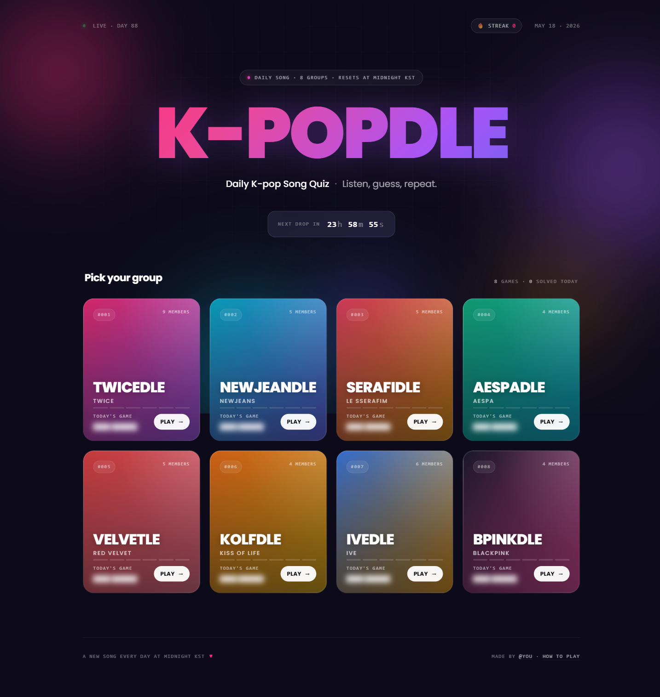
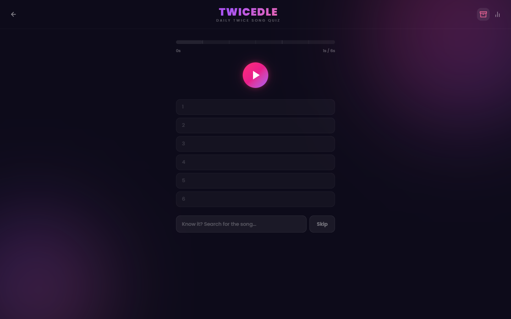
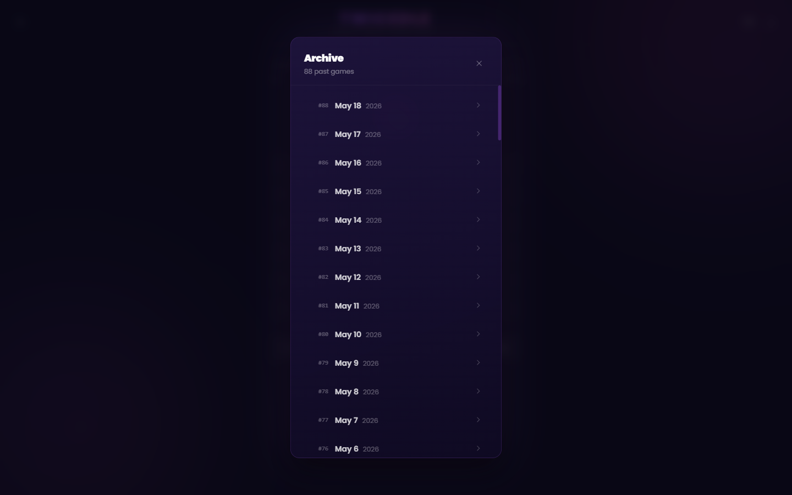

<div align="center">

# K-POPDLE

**A daily K-pop music guessing game platform — Heardle-style, for 34 groups.**

[](https://k-popdle.com)
[](https://react.dev)
[](https://vitejs.dev)
[](https://nodejs.org)
[](https://tailwindcss.com)
[](https://www.sqlite.org)

### [▶ Play at k-popdle.com](https://k-popdle.com)



**📈 Live & growing** — since launch, K-POPDLE has drawn **1.69k visits** and **1.76k page views** from players around the world, entirely organic. A fresh song every day keeps people coming back.

</div>

---

## What is it?

K-POPDLE is a full-stack daily music quiz platform. Players listen to a short audio snippet and guess the song — with each wrong answer revealing a slightly longer clip. Every group has its own independent daily game, driven by a deterministic **HMAC-SHA256** algorithm so the answer is consistent for all players worldwide.

Currently supports **34 groups** and **2,533 songs** (2,241 with verified 30-second Deezer preview URLs; the rest are catalogued but sit out of the daily rotation), current through 2026 releases. All song titles use their English names so every song is typeable on a standard keyboard.

---

## Features

### 🎵 Multi-Group Platform
Thirty-four K-pop groups — boy groups, girl groups, and legacy acts — each with their own daily game, color theme, and branded name. The K-POPDLE homepage shows all groups at a glance with glassmorphic cards and live solved-state detection from localStorage.

| Group | Game | Songs |
|---|---|---|
| TWICE | TWICEDLE | 100 |
| NewJeans | NEWJEANDLE | 21 |
| LE SSERAFIM | SERAFIDLE | 47 |
| aespa | AESPADLE | 74 |
| Red Velvet | VELVETLE | 130 |
| KISS OF LIFE | KOLFDLE | 43 |
| IVE | IVEDLE | 58 |
| BLACKPINK | BPINKDLE | 36 |
| BTS | BTSDLE | 108 |
| Stray Kids | SKZDLE | 126 |
| SEVENTEEN | SVTDLE | 134 |
| (G)I-DLE | GIDLEDLE | 57 |
| ENHYPEN | ENHYDLE | 76 |
| ATEEZ | ATEEZDLE | 93 |
| TOMORROW X TOGETHER | TXTDLE | 71 |
| ITZY | ITZYDLE | 60 |
| ILLIT | ILLITDLE | 19 |
| NMIXX | NMIXXDLE | 38 |
| EXO | EXODLE | 146 |
| BIGBANG | BIGDLE | 61 |
| SHINee | SHINEEDLE | 103 |
| MAMAMOO | MAMOODLE | 68 |
| Girls' Generation | SNSDDLE | 112 |
| BABYMONSTER | BABYDLE | 20 |
| RIIZE | RIIZEDLE | 23 |
| BOYNEXTDOOR | BNDDLE | 28 |
| TWS | TWSDLE | 26 |
| ZEROBASEONE | ZB1DLE | 37 |

### 🎮 Daily Game
- Up to **6 guesses**, each revealing a progressively longer audio clip
- Autocomplete search across the full group song catalog (Tab to complete, Enter to submit exact match)
- Skip to hear more, or guess early to flex
- After winning or losing, the full 30-second preview unlocks for replay
- Stats tracked locally: win rate, current streak (Wordle-style — breaks if you miss a day), max streak, guess distribution
- Shareable emoji grid result (includes difficulty badge and 💡 for hints used)



### 💡 Hint System
Three optional hints, revealed one at a time — era (album name), release year, and first letter of the song title. Hints are tracked per game and shown in the share output and result modal. Using hints doesn't cost a guess.

### 🎚️ Difficulty Modes
Three clip-length presets selectable at any time from the header. Persists across sessions.

| Guess | Easy | Normal | Hard |
|---|---|---|---|
| 1 | 3s | 1s | 0.5s |
| 2 | 5s | 2s | 1s |
| 3 | 8s | 3s | 1.5s |
| 4 | 10s | 4s | 2s |
| 5 | 12s | 5s | 3s |
| 6 | 15s | 6s | 4s |

### 🎯 Practice Mode
After completing the daily game, switch into unlimited practice with random songs from the same group's catalog. Practice runs don't affect streaks or stats.

### 📦 Archive Mode
Replay any past daily game. The same HMAC algorithm that picks today's song works for any past date — no extra storage needed. Archive results are namespaced separately and never touch daily stats.



### 🌐 K-POPDLE — Cross-Group Daily Challenge
A separate daily game at `/kpopdle` that draws from the full merged catalog of all 34 active groups. The song could be from any group — players must identify it without knowing which group it's from. The autocomplete labels each song with its group (e.g. `Black Mamba (aespa)`) for disambiguation, and the group is revealed in the result. Share output correctly labels results as `K-POPDLE #N M/6`. Archive mode is fully supported — replay any past K-POPDLE game from the archive button.

### 🎯 Guess the Group — Cross-Group, 3 Tries
A second cross-group daily at `/guess-the-group` that flips the audio quiz: *name the K-pop group*, not the song. The clip lengthens after each miss on a tight `1s → 3s → 6s` ladder, and the answer space is the full active-group roster, so the player picks from a scrollable grid of palette-tinted group chips (or types via autocomplete). One server-side hint is exposed — `year` — since `era` or `firstLetter` would give the group away. Cover/Audio toggles aren't applicable; share output uses `Guess the Group #N M/3`. Reuses the same HMAC daily-selection algorithm against the merged song pool.

### 🖼️ Coverdle — Album-Cover Reveal
Per-group cover-guessing mode at `/{group}/cover` (e.g. `/twice/cover`). The album cover starts heavily pixelated and sharpens with each guess: a `[6, 12, 22, 40, 90, full]` resolution ladder rendered to a canvas via nearest-neighbour scaling (no CSS blur — the mosaic is real). The **answer space is albums, not songs** — a Deezer album cover is typically shared by 5+ tracks on the same EP, so a song-level answer would degenerate into "the cover shows the *Get Up* EP; pick whichever song on it the coin flip chose today." The deduped album pool is built first-appearance in `songs.json` so the daily HMAC index stays stable across catalog edits, autocomplete lists albums, and `/guess` matches on album name. Six guesses, three hints (year → track count → first letter of the album). Cover-mode streaks live under a `${group}-cover` localStorage key, so a Coverdle solve doesn't double-count toward audio stats. A backfill script (`server/scripts/backfillCovers.js`) populates `coverUrl` on each song from the Deezer album endpoint; covers are served direct from Deezer's CDN. The site CSP `img-src https:` already allows them, and the canvas draws cross-origin without `crossOrigin` (the image renders, the canvas becomes tainted but no readback is ever needed).

### 🔗 Async Challenge — Share-a-Score
After finishing a daily, a player can copy a stateless challenge link (`/{group}?d={date}&c={base64url}`) that encodes their result inline — no server state. The recipient lands on the same daily, sees a **wax-seal banner** at the top (rotating dashed seal ring, palette-gradient initials disk, animated edge tape) showing the challenger's name + score-to-beat + reconstructed result grid. After their own game-over, a **VS card** replaces the standard result panel: two sides (YOU vs CHALLENGER), crowns on the winner, four outcome states (`you-win` / `they-win` / `tie` / `both-lost`) each with their own border, glow, and dynamic verdict copy. A Challenge Back button mints a fresh URL with the new player's result, closing the loop. The payload carries no answer-derivable data — only `{v, a, w, h, n?}` (version, attempts, won, hintsUsed, optional display name).

### ⚔️ Battle — Real-Time 1v1
A live multiplayer mode at `/battle` — two players, five synchronized rounds, race to guess the same 30-second clip. Speed-scored 5/4/3/2/1 by time bucket; higher total wins, ties resolve via sudden-death rounds. Anonymous: a display name and a persistent local `playerToken` are enough; no sign-in required. Built on **Socket.IO** sharing the existing Express session, with a server-authoritative state machine and a separate **audio proxy** (`/api/battle/:matchId/clip/:roundToken`) that streams Deezer clips behind opaque per-round tokens — so the answer's identity is unobtainable client-side before each reveal. Robust to dropped tabs: a 15-second reconnect grace covers a refresh or background tab; an explicit leave or grace expiry forfeits to the opponent. The UI uses a dual you-pink / foe-cyan identity over the same dark glassmorphic language as the rest of the site.

### 🧭 Mode Discovery
The homepage opens with a **"Pick your way to play"** section that surfaces the cross-group modes (K-POPDLE hero, Guess the Group, Battle) as landscape cards with per-mode visual centerpieces — animated waveform + vinyl for the audio family, group cluster for GTG, fan-stacked cards for K-POPDLE, VS plate for Battle. Per-group dailies (audio + Coverdle) live in the group grid below; an in-game **`<ModeToggle>`** segmented switch on every group screen flips between Audio and Cover without leaving the page (NEW chip on the Cover side). On the group cards themselves, two small pips per card (`A` / `C`) show today's completion state for each mode independently — green-tick when won, red-X when missed, ghost when not yet played.

### 🔐 User Accounts
Sign in with Google to sync your streaks, guess distributions, and game history across any device. Accounts are optional — the game is fully playable without signing in, with all stats kept in localStorage. On first login, existing localStorage stats are automatically imported to the cloud. After each daily game, stats are synced to the server so they're available on any device. A sign-in prompt appears once per browser session after your first completed game. Logged-in users see their Google avatar in the header and a "synced" indicator in the stats modal. Full GDPR account and data deletion available.

### 📊 Analytics Collection
Every completed daily game anonymously records: group, song, guess count, win/loss, every wrong guess made, hints used, and difficulty. Stored in a local SQLite database and queryable via API endpoints.

### 📈 Admin Analytics Dashboard
A private, in-app analytics dashboard at `/admin`, gated behind a Google-account allowlist. It's a self-hosted alternative to a hosted observability tool — every request is logged to SQLite by a lightweight middleware (IPs hashed, never stored), then visualised with hand-built dependency-free SVG charts. Surfaces traffic and error rates over time, status-code distribution, top error paths (with automatic bot-scan tagging), latency percentiles (p50/p95/p99), geographic breakdown, audience growth, game analytics, and a live request feed. Lazy-loaded so it adds zero weight to the game bundle.

### 📱 Responsive Design
Fully playable on phones, tablets, and desktop. The game header condenses its controls into icons on small screens (difficulty and sign-in collapse to icon buttons) so even the longest group name fits, day-navigation arrows reposition to the bottom corners on mobile to avoid overlapping the guess grid, the homepage hero and cross-group banner reflow into stacked layouts, and the group card grid steps from four columns down to one as the viewport narrows.

---

## Technical Highlights

### Deterministic Daily Song Selection
The daily song is chosen with:
```
HMAC-SHA256(secret-{groupId}, KST-date-string) mod catalog_size
```
This means:
- Every player worldwide gets the same song with no coordination
- Historical games are fully reproducible — the archive works without storing any past state
- Each group's rotation is independent (secret namespaced per group)

> See [`docs/ARCHITECTURE.md`](docs/ARCHITECTURE.md) for the full ADR — including the subtle constraint that reordering a song catalog re-rolls every past day's answer.

### Audio Pipeline
Songs play as 30-second MP3 previews via the **Deezer public API** — no auth required. The server resolves preview URLs with a two-step fallback:
1. Direct lookup by stored Deezer track ID
2. Artist + title search fallback

On startup the server pre-warms the preview URL cache for all 34 active groups sequentially, so the first player each day never waits on Deezer.

### Analytics Database
Game results are written to a SQLite database (`better-sqlite3`) at the end of every daily game. Three query endpoints expose aggregated insights:

| Endpoint | Returns |
|---|---|
| `GET /api/stats/summary` | Per-group win rate, avg guesses, hint usage, difficulty split |
| `GET /api/stats/songs/:group` | Song difficulty ranking — hardest songs first |
| `GET /api/stats/confusion/:group` | Most common wrong guesses per song (confusion matrix) |

The POST is fire-and-forget from the client — it never blocks or affects gameplay. The record endpoint has its own tighter rate limit (10/min) and full input validation to prevent analytics pollution.

### Request Telemetry Pipeline
A single Express middleware (`requestLog`) records every request on response finish — method, path, status, latency, country, and an authenticated user id when present. It runs after Passport (so `req.user` is populated) and before the routes (so it wraps every endpoint), skips static assets and its own dashboard polling, and writes synchronously via a prepared statement so it never adds measurable latency. Client IPs are hashed with HMAC-SHA256 (never stored raw), and country comes free from Cloudflare's `cf-ipcountry` edge header. Vulnerability scanners (`wp-config.php`, `.env`, credential probes) are classified as bots so the dashboard can separate real failures from internet background noise. Telemetry is auto-pruned after 90 days. The `/api/admin/dashboard` endpoint composes the entire view in one query round-trip.

### Cloudflare Historical Backfill
Because per-request telemetry only began the day the dashboard shipped, a backfill imports the period before that from **Cloudflare's GraphQL Analytics API**. Requests/status/country come from the `httpRequests1hGroups` dataset (non-sampled); top paths come from the sampled adaptive dataset (`count × sampleInterval`). Cloudflare caps each query's time range (≈3 days for hourly, ≈1 day for the adaptive path data) and retention is plan-dependent — on the **Free plan only ~3 days** are available — so the importer walks the span in sub-cap windows, newest first, and stops once it hits the retention edge. All of it lands in separate history tables (`th_status`, `th_geo`, `th_path`) — never mixed into the per-request log. The dashboard then **merges** the two sources along a boundary (the first live-telemetry timestamp): backfill fills strictly before it, live data covers at/after it, so the two never double-count, and the traffic chart draws a marker at the seam. Latency, unique visitors, and the live feed stay live-only, since Cloudflare's aggregates don't carry that detail.

The same import logic (`runBackfill`) is exposed two ways:
- **In-app button** on `/admin` → `POST /api/admin/backfill` — runs inside the deployed container, so it can write to the production SQLite volume. This is the way to backfill production.
- **CLI** for local/dev: `node server/scripts/backfillCloudflare.js --days 30`.

> A local `railway run` of the CLI would write to a local path, not the mounted volume — which is why production backfill goes through the in-app endpoint instead.

### Security
- Content-Security-Policy header restricts script, style, media, font, and image sources
- Per-route rate limiting on sensitive endpoints (tighter than the global 100/15min baseline)
- All DB writes use parameterized queries (no SQL injection surface)
- `httpOnly` session cookies with `sameSite: lax` and `secure` in production
- `ON DELETE CASCADE` throughout the user tables for clean GDPR erasure
- Admin dashboard gated by a server-side email allowlist; request telemetry hashes IPs and stores no PII

### Error Tracking, Logging & Health Checks
Runtime health is observable without a third-party log drain bolted on top:
- **Sentry** captures exceptions on both ends — `@sentry/node` (server, initialised before app code in `instrument.js`) and `@sentry/react` (browser, wrapping the app in an error boundary). Both are wired **entirely behind env vars** (`SENTRY_DSN` / `VITE_SENTRY_DSN`), so the app runs as a clean no-op until a DSN is supplied. Production frontend builds upload source maps via `@sentry/vite-plugin` — then delete them so original source isn't served publicly — and a build-time `define` strips the Sentry tracing/debug code the app doesn't use.
- **Structured logging** via `pino`: every server log line is JSON (queryable in Railway's log view), and a small `captureError` helper logs *and* forwards to Sentry in one call.
- **`GET /healthz`** — a liveness probe (Railway's healthcheck target) that returns `200` while the database is reachable, `503` if not. Audio/Deezer status is reported in the body but is deliberately **non-fatal**: a Deezer outage is external and can't be fixed by a restart, so it never triggers a restart loop. It's defined ahead of the telemetry middleware so health polls don't pollute the request log.

### Discoverability (SEO)
The SPA is tuned for search and social sharing despite being client-rendered. `index.html` ships Open Graph, Twitter-card, and JSON-LD (`WebSite` + `VideoGame`) tags, an SVG favicon, and a web manifest — but **no static canonical or `og:url`**, because hardcoding `/` as the canonical caused Google's URL Inspection live test to reject every sub-route as a duplicate of the homepage. Instead, a `useDocumentMeta` hook injects the per-route title, description, canonical URL, and `og:url` once React mounts; Googlebot self-canonicalizes to the requested URL on the pre-render pass and confirms via the JS-injected tag on the rendered pass. A static `robots.txt` and `sitemap.xml` (73 URLs — homepage, K-POPDLE, all 34 group dailies, all 34 Coverdle routes, Guess the Group, Battle, Stats) are served straight from the build output, ahead of the SPA catch-all.

Because the game UI is mostly chrome + a guess grid, the rendered body text on each game route was ~100 chars — enough to trip Google's **Soft 404** classifier. A shared `<GameAboutSection>` component now ships ~1500 chars of per-route descriptive copy on every thin route, rendered inside a default-collapsed `<details>` disclosure. Users see a single slim row at the bottom of the page; Googlebot reads the full content from the initial HTML (accordion content is indexed regardless of open state — *not* the same as `display:none`-for-SEO cloaking, which the spam policies explicitly penalize).

### Multi-Group Architecture
Per-group routes are parameterised: `/api/:group/game/today`, `/api/:group/songs`, `/api/:group/cover/today`, etc. A `validateGroup` middleware guards every per-group route — inactive or unknown group IDs return 404, preventing catalog probing before a group launches. Cross-group modes mount under their own route families (`/api/kpopdle/*`, `/api/guess-the-group/*`, `/api/battle/*`) which compose against a merged song pool built from all active groups.

### React Context for Shared State
A single `GroupContext` carries the active `groupId`, `archiveDate`, `practiceMode`, and `difficulty`. All hooks (`useGame`, `useSongList`, `useStats`) read from this context — no prop drilling through the component tree.

---

## Tech Stack

| Layer | Tech |
|---|---|
| Frontend | React 19, React Router v7, Tailwind CSS v4, Vite 7 |
| Backend | Node.js, Express, Socket.IO (Battle realtime) |
| Database | SQLite via `better-sqlite3` (analytics + user accounts) |
| Auth | Google OAuth2 via Passport.js, server-side sessions |
| Audio | Deezer Public API (free, no auth) |
| Client storage | localStorage — namespaced per group (stats, streaks, game state) |
| Observability | Sentry (client + server), `pino` structured logs, `/healthz` liveness |
| Testing & CI | Vitest (client + server), GitHub Actions (tests · build · lint) |
| Fonts | Poppins (UI), JetBrains Mono (data labels) |

---

## Project Structure

```
├── .github/workflows/             # ci.yml — validators · tests · build · lint on push/PR
├── docs/ARCHITECTURE.md           # ADRs: HMAC-as-archive + expiry-aware Deezer cache
├── scripts/                       # validate-songs.js, validate-constants.js (pure-Node CI guards)
│
├── client/                        # React frontend (Vite)
│   └── src/
│       ├── components/            # AudioPlayer, GuessInput, ArchiveModal,
│       │   │                      #   GroupCard, ModeCard, ModeToggle, CoverGame,
│       │   │                      #   GuessTheGroupGame, GameAboutSection, ...
│       │   ├── admin/             # SVG chart primitives (charts.jsx, format.js)
│       │   ├── account/           # Account dashboard widgets (multi-group stats)
│       │   └── battle/            # Lobby, RoundView, ResultScreen
│       ├── hooks/                 # useGame, useCoverGame, usePracticeGame, useSongList,
│       │                          #   useStats, useAudioPlayer, useCountdown,
│       │                          #   useDocumentMeta (per-route SEO meta injection)
│       ├── lib/                   # api.js, storage.js, GroupContext.js, share.js,
│       │                          #   stats.js (pure streak reducer), observability.js (Sentry),
│       │                          #   battleSocket.js (Socket.IO singleton + reconnect),
│       │                          #   serverTime.js (round-countdown clock sync)
│       └── pages/                 # HomePage, GroupPage, KpopdlePage, CoverPage,
│                                  #   GuessTheGroupPage, BattlePage, AccountPage,
│                                  #   StatsPage, AdminPage (all lazy-loaded)
│
└── server/                        # Express backend
    ├── scripts/                   # backfillCloudflare.js, backfillCovers.js
    └── src/
        ├── instrument.js          # Sentry init — imported first, before app code
        ├── data/
        │   ├── groups.json        # Group registry (34 groups, colors, launchDate)
        │   ├── launch.js          # K-POPDLE launch date (single source; mirrored client-side)
        │   ├── songIndex.js       # Merged cross-group song pool (kpopdle + guess-the-group)
        │   ├── groups/{id}/
        │   │   └── songs.json     # Per-group song catalog with Deezer IDs + cover URLs
        │   └── stats.db           # SQLite analytics database (git-ignored)
        ├── middleware/            # validateGroup, cors, rateLimit, requestLog, requireAdmin
        ├── routes/                # groups, game, songs, stats, admin, auth,
        │                          #   kpopdle, cover, guessTheGroup, battle
        ├── realtime/              # Battle: Match, MatchManager, scoring, songSelection,
        │                          #   socket.js (Socket.IO server + auth)
        ├── services/              # dailySong, audioProvider, statsDb, adminDb,
        │                          #   cloudflareClient, backfill, health, observability
        └── utils/                 # dateUtils, cache, botPatterns
```

Tests live next to the code they cover (`*.test.js`), run with Vitest in both packages.

---

## Getting Started

**Prerequisites:** Node.js 18+

```bash
# Clone
git clone https://github.com/CZ140/Kpopdle.git
cd Kpopdle

# Install all dependencies
npm run install:all

# Configure environment — server/.env.example documents every variable
cp server/.env.example server/.env
# Edit server/.env. Required:
#   DAILY_SONG_SECRET — random string (daily song selection)
#   SESSION_SECRET    — random string (session signing + IP hashing)
# Sign-in (Google OAuth):
#   GOOGLE_CLIENT_ID / GOOGLE_CLIENT_SECRET / GOOGLE_CALLBACK_URL, CLIENT_URL
# Admin dashboard:
#   ADMIN_EMAILS      — comma-separated Google emails allowed into /admin
# Production:
#   DB_PATH           — persistent volume dir so SQLite (stats + telemetry +
#                       sessions + users) survives redeploys
# Optional:
#   CLOUDFLARE_API_TOKEN / CLOUDFLARE_ZONE_ID — historical analytics backfill
#                       (token needs Zone → Analytics → Read)
#   SENTRY_DSN / SENTRY_AUTH_TOKEN, LOG_LEVEL — error tracking + logging

# (Optional) browser error tracking — set VITE_SENTRY_DSN
cp client/.env.example client/.env.local

# Start both client and server
npm run dev
# Client → http://localhost:3000
# API    → http://localhost:3001
```

On first start the server warms the Deezer preview cache for all 34 groups before serving requests — you'll see `Cache warm.` in the terminal when it's ready.

### Testing & quality

```bash
npm test                 # run both test suites (server + client)
npm run lint --prefix client   # ESLint
npm run build --prefix client  # production build
npm run validate:songs         # structural check of every song catalog (--online probes Deezer)
node scripts/sync-deezer-catalog.mjs           # lists songs a group has released but the catalog lacks (--apply writes, --since YEAR)
npm run validate:constants     # fails if the client's group-metadata mirror drifts from the server
```

Every push and PR runs the same tests, build, lint, and both data validators via GitHub Actions (`.github/workflows/ci.yml`). The two pure-Node validators run first (no install needed) so a malformed catalog or a client/server metadata mismatch fails fast.

---

## Roadmap

- [x] Phase 1 — Multi-group architecture & K-POPDLE homepage
- [x] Phase 2 — Song databases for all 8 launch groups (509 songs, Deezer-verified)
- [x] Phase 3 — Practice mode (unlimited random rounds, no stats impact)
- [x] Phase 4 — Archive mode (replay any past daily game)
- [x] Phase 5 — Hint system (era / year / first letter, tracked in share output)
- [x] Phase 6 — Difficulty modes (Easy / Normal / Hard clip lengths)
- [x] Phase 7 — K-POPDLE cross-group challenge (daily game drawn from all active catalogs, group revealed on finish)
- [x] Phase 8 — User accounts (Google OAuth, cloud streak + stats sync, GDPR account deletion)
- [x] Phase 9 — Battle (real-time 1v1, Socket.IO, server-authoritative scoring + audio proxy)
- [x] Phase 10 — Guess the Group + Coverdle + Async Challenge + homepage Game Modes section
- [x] Phase 11 — Design unification (dashboard vibe + Battle parity), Coverdle album-answer fix, SEO indexability (per-route canonical via `useDocumentMeta`, `<GameAboutSection>` for Soft-404 mitigation, expanded sitemap)
- [x] Phase 12 — Roster expansion to 28 groups (BTS, Stray Kids, SEVENTEEN, (G)I-DLE, ENHYPEN, ATEEZ, TXT, ITZY, ILLIT, NMIXX, EXO, BIGBANG, SHINee, MAMAMOO, Girls' Generation, BABYMONSTER, RIIZE, BOYNEXTDOOR, TWS, ZEROBASEONE — 1,406 new songs across boy groups, 4th/5th-gen, and legacy acts)
- [x] Phase 13 — Roster expansion to 34 groups (STAYC, Hearts2Hearts, fromis_9, HITGS, KiiiKiii, XG — 179 new songs; catalogs built directly from each artist's verified Deezer discography so every track has a working preview)

---

<div align="center">
  <sub>Built by <a href="https://github.com/CZ140">Chris</a> &nbsp;·&nbsp; A new song every day at midnight KST ♥</sub>
</div>
